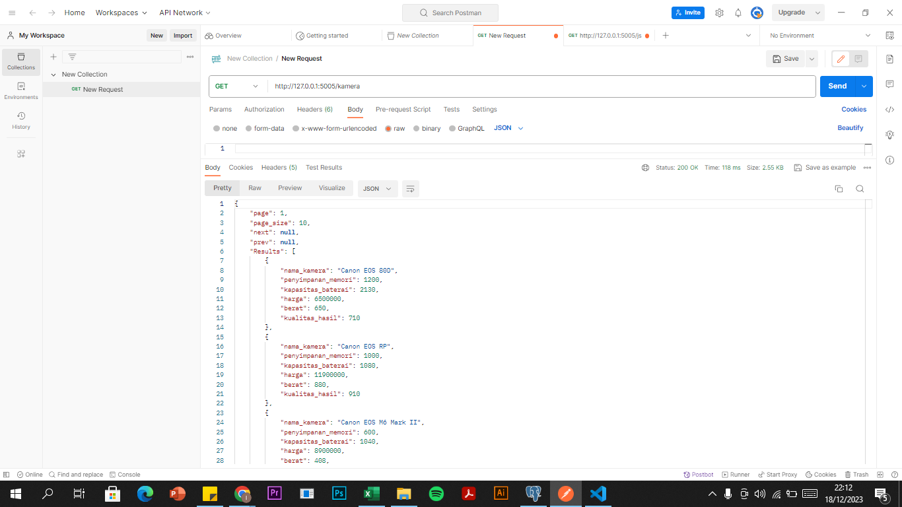
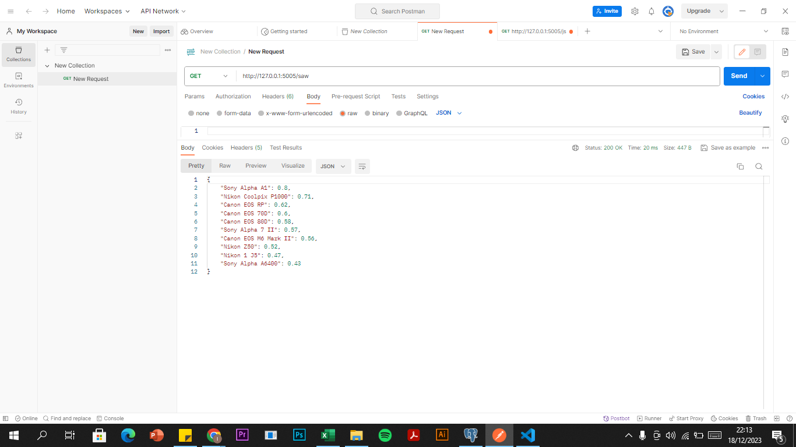
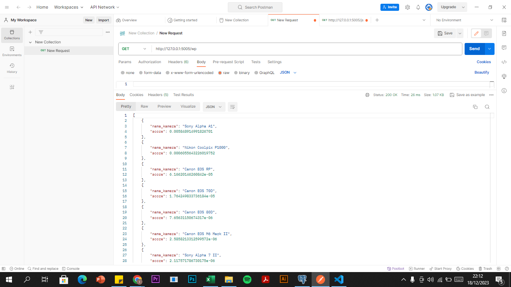
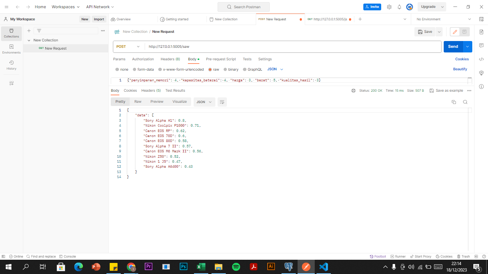
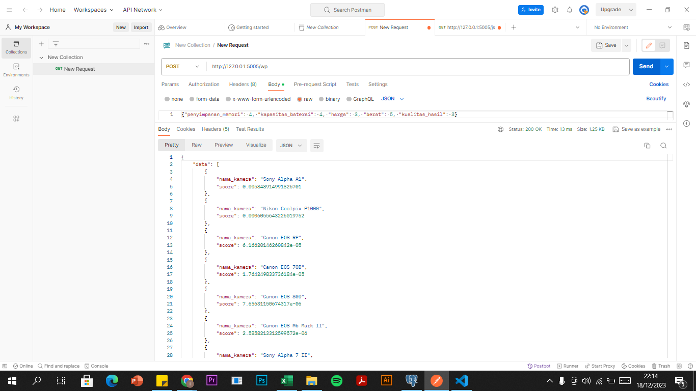

# spk_web
## Install, create and activate virtualenv
https://medium.com/analytics-vidhya/virtual-environment-6ad5d9b6af59

## Install requirements

    pip install -r requirements.txt

## Run the app
to run the web app simply  use

    python main.py

## Usage
Install postman 
https://www.postman.com/downloads/

get table rekomendasi

get saw rekomendasi

get wp rekomendasi

ref:
https://en.wikipedia.org/wiki/Pearson_correlation_coefficient

### TUGAS UAS
ini adalah implementasi model web api dengan http method `POST`, contoh implemantasinya dapat dilihat pada repositori ini untuk api recommendation.

INPUT: {'penyimpanan_memori': 4, 'kapasitas_baterai': 4, 'harga': 3, 'berat': 5, 'kualitas_hasil': 3}
OUTPUT (diurutkan / sort dari yang terbesar ke yang terkecil):

post saw rekomendasi

post wp rekomendasi
